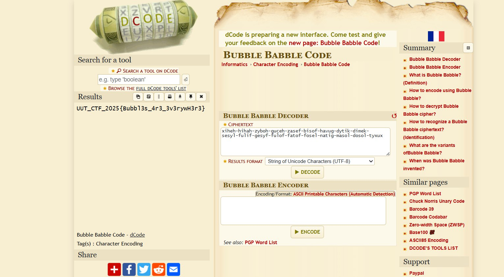

## Title

Bubblegum Cipher — Cryptography 

* **Author:** shaghayeghfarzaneh • **Date:** 2025-11-17

---

## Difficulty / Time spent

Easy • 1 hour

---

## Tags

Tags: crypto, encoding, bubblebabble, python 

---

## TL;DR

The file was BubbleBabble-encoded → decoded using both the bubblepy Python library and an online decoder (dcode.fr).

---

## Problem

A file named `BubblegumCipher.bubbly` was provided in the Question folder containing a long BubbleBabble string:

xiheh-hihah-zyboh-guceh-zasef-bisof-havug-dytik-dimek-sesyl-fulif-gesyf-fulof-fatof-fosel-natig-masol-dosol-tyxux

(BubbleBabble is a text-based binary encoding (similar to Base64) designed to be more human-readable and pronounceable. It is often used in CTF challenges to obfuscate flags or small binary payloads while still keeping them as plain text. The goal was to decode this string to retrieve the hidden flag.)

The goal was to decode it and retrieve the flag.

---

## Tools

- Python 3 + bubblepy
- Online decoder: https://www.dcode.fr/bubble-babble-code

---

## Steps (reproducible)

1. Install the required library

  pip3 install bubblepy

2. Python one-liner (fastest)
  python3 -c "from bubblepy import BubbleBabble; print(BubbleBabble().decode(open('Question/BubblegumCipher.bubbly').read().strip()).decode())"

  Or run the full script below (Answer/decode.py)
    from bubblepy import BubbleBabble
    import os

    current_dir = os.path.dirname(os.path.abspath(__file__))
    file_path = os.path.join(current_dir, "..", "Question", "BubblegumCipher.bubbly")

    bb = BubbleBabble()

    with open(file_path, "r") as f:
        encoded_text = f.read().strip()

    print(encoded_text)

    flag_bytes = bb.decode(encoded_text)
    flag = flag_bytes.decode('utf-8')

    print(f"Flag: {flag}")

3. Alternative online method
    Go to https://www.dcode.fr/bubble-babble-code
    Paste the BubbleBabble string → flag appears instantly

---

## Flag

UUT_CTF_2025{Bubbl3s_4r3_3v3rywH3r3}

---

## Screenshots

---

## Repo layout (suggested)

/Questions/Cryptography/Bubblegum Cipher/
  /Question/
    BubblegumCipher.bubbly          * original challenge file (BubbleBabble-encoded string)
    /Answer/
      decode.py                        * Python script that automatically decodes the file and prints the flag
      solution.md                      * this write-up
    screens/
      bubblegum-online-decoder.png   * screenshot of the online decoder result (dcode.fr)

---
