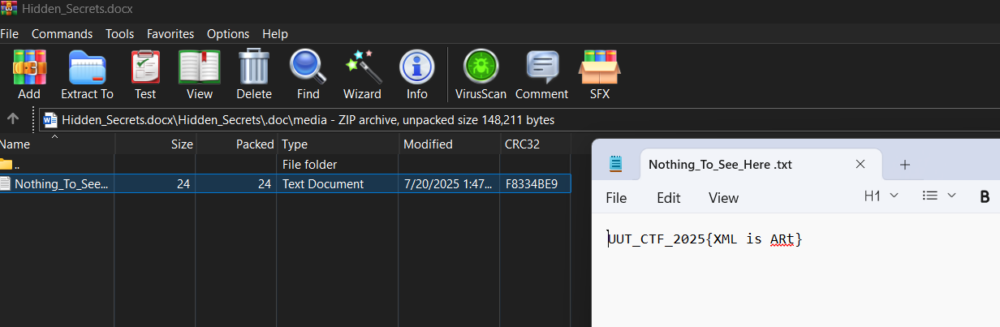

## Title

`Word Legacy` — `Forensics`

* **Author:** `ashkaqn` • **Date:** `9/23/2025`

---

## Difficulty / Time spent

`Difficulty: Easy` • `Time: 5m`

---

## Tags

`Tags: forensics, word, docx, zip,`

---

## TL;DR

Flag is hidden inside the docx file structure (along with fake flags); Open the docx file with zipviewer/Winrar and seek hidden folders to find the flag.

---

## Problem

A modified docx file provided; When opened with Word/docx-viewer, it displays a paragraph that explains the question but the flag is not visible, hiding the fact that the flag is in a folder (along with fake flags) inside the docx file structure.

---

## Tools

* `docx`,`Word`,`zip`,`winRar`

---

## Steps (reproducible)

1.  Locate the provided `Hidden_Secrets.docx` file.
2.  Open with a zip-viewer/WinRar.
3.  Search for the flag (between fake ones) in a .txt file inside the zip -->(Hidden_Secrets ZIP >> Hidden_Secrets>> .doc>> media>> Nothing_To_See_Here .txt)

---

## Flag

`UUT_CTF_2025{XML is ARt}`

---

## Screenshots

*A screenshot showing the flag in a txt file inside the docx file opened as Zip *


---

## Repo layout (suggested)

```
/Forensics/
  /Word Legacy/
    /Question/
      Hidden_Secrets.docx #main file containing the question and flag inside
      description.txt  #little description about the question
    /Answer/
      README.md #markdown file explaining the answer
```