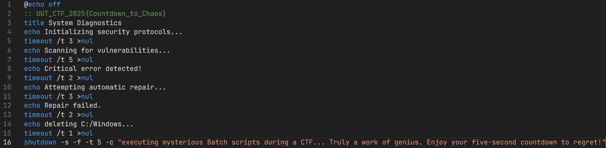

## Title

`Terminal` — `Forensics` (`50 Points`)

* **Author:** `<MazharPir>` • **Date:** `9/22/2025`

---

## Difficulty / Time spent

`Difficulty: Easy` • `Time: 5m`

---

## Tags

`Tags: forensics, batch, script, windows`

---

## TL;DR

The flag is hidden in a comment on the first line of a deceptive batch script; the solution is to read the file's source code instead of executing it.

---

## Problem

A Windows batch script (`self_distructed.bat`) is provided. When executed, it displays a fake system error and initiates a shutdown countdown, hiding the fact that the flag is plaintext in the source code.

---

## Tools

* Any standard text editor (e.g., VS Code, Notepad).

---

## Steps (reproducible)

1.  Locate the provided `self_distructed.bat` file.
2.  **Do not run the file.** Open it using a text editor.
3.  The flag is written in plain text as a comment on the first line.

---

## Flag

`UUT_CTF_2025{Countdown_to_Chaos}`

---

## Screenshots

*A screenshot showing the flag in the batch script's source code.*

---