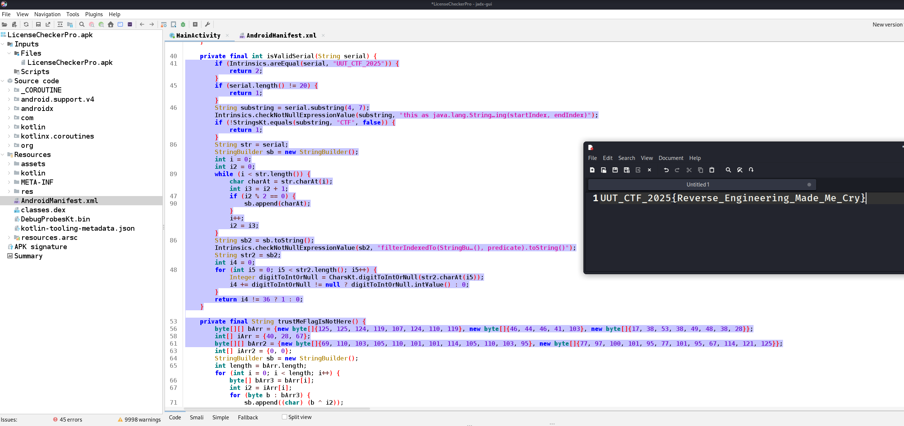

## Title

`Shadow Hunter` — `Mobile Security` (`350 Points`)

* **Author:** `Mojtaba Fotohi` • **Date:** `10/20/2025`

---

## Difficulty / Time spent

`Difficulty: Medium` • `Time: 10m`

---

## Tags

`Tags: Mobile, Reverse Engineering, Java`

---

## TL;DR

By decompiling the APK with jadx, the main activity was identified from AndroidManifest.xml. Analyzing the serial validation logic, crafting a valid serial (e.g., `5X5XCTFX5X5X4X4X4X4X`), and decoding the flag generation using XOR and simple addition yielded the flag.

---

## Problem

Our challenge was understanding the serial validation logic and decoding the XOR operation to generate the flag. Crafting a valid serial with length and digit sum constraints was also difficult.

---

## Tools

jadx: (APK decompiler)

---

## Steps (reproducible)

Here are the steps we took to solve the problem and obtain the flag, listed concisely:

1. **Decompiled the APK**: Used **jadx** to decompile the APK file, extracting the Java/Kotlin source code and identifying the `MainActivity` class from `AndroidManifest.xml`.
2. **Analyzed MainActivity**: Examined the `MainActivity` code to understand the serial validation logic in the `isValidSerial` method and the flag generation in the `trustMeFlagIsNotHere` method.
3. **Understood Serial Validation**: Determined that `isValidSerial` requires a 20-character serial with "CTF" at indices 4–6, and the sum of digit values at even indices (0, 2, 4, 6, 8, 10, 12, 14, 16, 18) must equal 36.
4. **Crafted a Valid Serial**: Constructed a valid serial, `5X5XCTFX5X5X4X4X4X4X`, meeting the length, substring ("CTF"), and digit sum (36) requirements.
5. **Decoded the Flag**: Analyzed `trustMeFlagIsNotHere`, applying XOR operations (for `bArr` with `iArr`) and simple addition (for `bArr2` with `iArr2`) to decode the flag.
6. **Obtained the Flag**: Combined the decoded parts to get the final flag: `UUT_CTF_2025{Reverse_Engineering_Made_Me_Cry}`.

---

## Flag

`UUT_CTF_2025{Reverse_Engineering_Made_Me_Cry}`

---

## Screenshots

---

