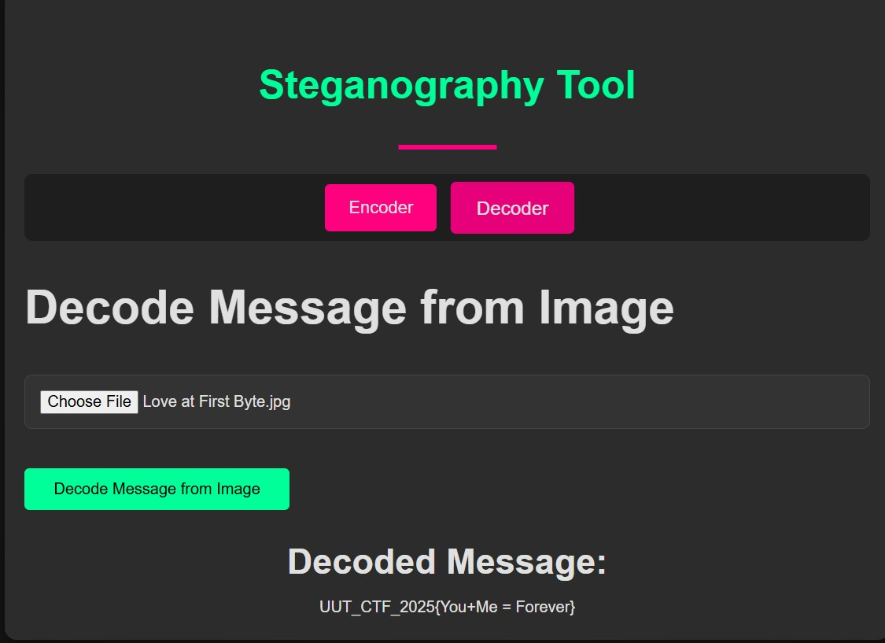

## Title

`Love at First Byte` — `Stegnography`

* **Author:** `MehranMr17` • **Date:** `9/20/2025`

---

## Difficulty / Time spent

`Difficulty: Easy` • `Time: 10m`

---

## Tags

`Tags: image, decode` 

---

## TL;DR

Use the Stegano library's reveal method to extract hidden text from the image.

<!-- Example: *SQLi on `/login` → extract admin token → read `/flag`.* -->

---

## Problem

Only one image was provided, which had to be decoded to access the hidden text.
The hidden text inside the image was the competition flag.

---

## Tools

https://iicsf.com/steganography-online/ or python3


---

## Steps (reproducible)

Numbered, minimal commands. Keep outputs brief.

1. Download the image.
2. Upload the image into the website (steganography-online).
3. Get the hidden text and exract the flag from it.


---

## Flag

`UUT_CTF_2025{You+Me = Forever}`

---

## Screenshots



---

## Repo layout (suggested)

```
/Stegnography/
  /Love at first byte/
    /Question/
      Encoder.ipynb
      Love at First Byte.jpg
    /Answer/
      Decodee.ipynb
      Love at First Byte.md
```

