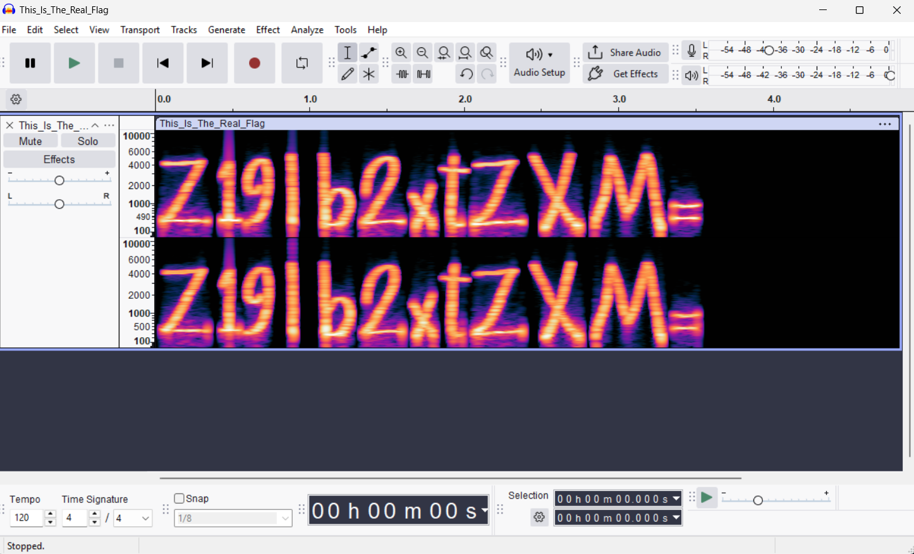

## Title

`Voice` — `Stegnography` (`Points: unknown`)

* **Author:** `Mahdi Ranjkesh` • **Date:** `2025-10-01`

---

## Difficulty / Time spent

`Difficulty: Easy` • `Time: 5-15 min`

---

## Tags

`Tags: audio, stego, spectrogram, audacity`

---

## TL;DR

Open the provided WAV file in Audacity, switch the track view to Spectrogram and inspect the frequency display — the flag appears visually in the spectrogram. The file contains the base64 string `U2hlcmxvY2tfRmxhZ19ob2xtZXM=` which decodes to `Sherlock_Flag_holmes`.

---

## Problem

An audio file was provided (`Open_Me_Babe.wav` and supporting WAV files in `src/`). The goal is to find the hidden flag embedded in the audio's spectrogram image.

Files:

- `Questions/Stegnography/Voice/Question/Open_Me_Babe.wav`
- `Questions/Stegnography/Voice/Question/src/Definitely_A_Flag.wav` (additional sample files)

---

## Tools

- Audacity (https://www.audacityteam.org/)
- Python 3 (for decoding base64 if needed)

---

## Steps (reproducible)

1. Open Audacity.
2. File → Open → select `Questions/Stegnography/Voice/Question/Open_Me_Babe.wav`.
3. On the audio track, click the track name (left panel) to open the dropdown menu and choose `Spectrogram` → `Spectrogram Settings...` (or View → Spectrogram View on newer versions).
4. Recommended spectrogram settings (adjust if needed):
   - Window size / FFT: 2048 (or 1024)
   - Range: `-120 dB` to `0 dB`
   - Gain: default
   - Maximum frequency: leave default unless letters are truncated
5. Zoom vertically and horizontally (View → Zoom) until the text in the spectrogram is legible. The hidden string/flag will appear as readable letters drawn in the frequency domain.
6. Copy the visible string. In this challenge the spectrogram shows the base64 string `U2hlcmxvY2tfRmxhZ19ob2xtZXM=`.
7. Decode the base64 string to readable text. Example using Python 3:

```bash
python -c "import base64;print(base64.b64decode('U2hlcmxvY2tfRmxhZ19ob2xtZXM=').decode())"
```

Or using a short PowerShell one-liner on Windows:

```powershell
[System.Text.Encoding]::UTF8.GetString([System.Convert]::FromBase64String('U2hlcmxvY2tfRmxhZ19ob2xtZXM='))
```

---

## Flag

Base64 (as seen in spectrogram):

`U2hlcmxvY2tfRmxhZ19ob2xtZXM=`

Decoded flag:

`Sherlock_Flag_holmes`

---

## Screenshots

One small screenshot of the Audacity spectrogram view is included .

Example embed (relative path from this file):



_Caption:_ Spectrogram view in Audacity where the base64 string is visible.

---

## Short fix for authors

No vulnerability — this is a steganography challenge. If accidental leakage is undesired, avoid publishing raw media with visible spectrogram content.

---

## Repo layout (challenge)

```
/Stegnography/
  /Voice/
    /Question/
      Open_Me_Babe.wav
      src/Definitely_A_Flag.wav
    /Answer/
      README.md  # this file
```

End of write-up.
